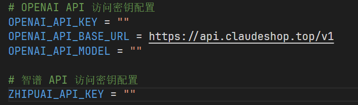

## 更新日期
2024.11.15

## 安装依赖

创建 conda 虚拟环境

```python
conda create -n llm-rag python=3.10
```

激活虚拟环境

```
conda activate llm-rag
```

切换到 readme 文件所在目录后执行

```python
pip install -r requirements_20240809.txt
```

pip 和 conda 源配置查看此文：[anaconda 环境管理](https://www.yuque.com/u39067637/maezfz/syzlisxdbqmp7k6s)

## 运行环境

vscode + python 插件 + anaconda虚拟环境  
使用openai的api的话，需要打开代理，代理到能使用 openai 的地区

## 运行代码

### 1.命令行中运行（自 2024.6.27 已不维护）

1. 首先运行大模型科学检索文件  
   这个文件用来根据用户生成关键词和搜索下载文献  
   下载好的 pdf 会存入当前目录下的 papers 文件夹中
2. 然后运行 embedding 文件，将 pdf 文件嵌入到向量数据库  
   这个数据库会建立在指定目录下的 vector_db 文件夹中
3. 最后运行检索问答文件，这里需要填入你的 **_openai api key_**，然后得到经过 RAG 之后的回答

zhipuai_embedding 文件使用 langchain 来封装智谱的向量嵌入 api。  
zhipuai_llm 文件定义了一个 ZhipuAILLM 类，继承自 LLM，用于调用智谱 AI 的对话模型。

### 2.网页中运行

1. 根目录下新建.env 文件，按如下格式填写 api 信息
   
   导入 apikey 信息的页面为 mysite/api/views.py
2. 切换目录至 mysite 文件夹下（manage.py 文件所在目录）（polls 目录是学习测试用的）  
   主要代码在**mysite/api**文件夹中
3. 运行命令：
   ```
   python manage.py runserver
   ```
4. 打开浏览器，访问 http://127.0.0.1:8000/api/chat

目前网页中运行的是已经完成了向量的嵌入的，当前 RAG 的关键词是"纳米金和核酸适配体"

#### 注：

目前网页中运行效果好于命令行中的，代码有所改动  
当前用的 pdf 的 embedding 模型是智谱的  
**搜索文档和生成向量数据库的步骤依然需要手动执行，即“命令行运行”中的步骤 1 和步骤 2。**

### 3.graphRAG

在 graphRAG 文件夹下，需要额外下载

```python
pip install graphrag
```
